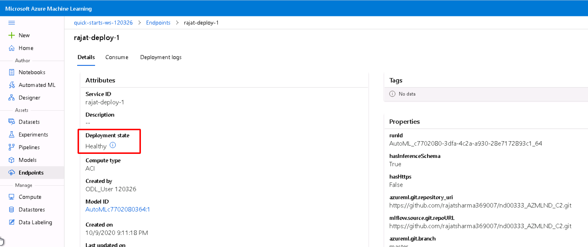
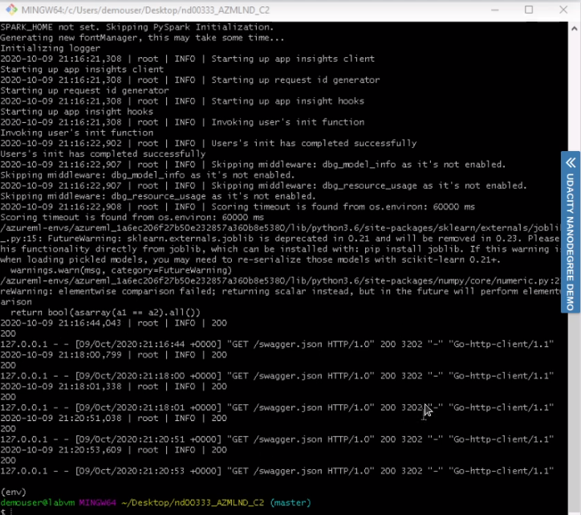
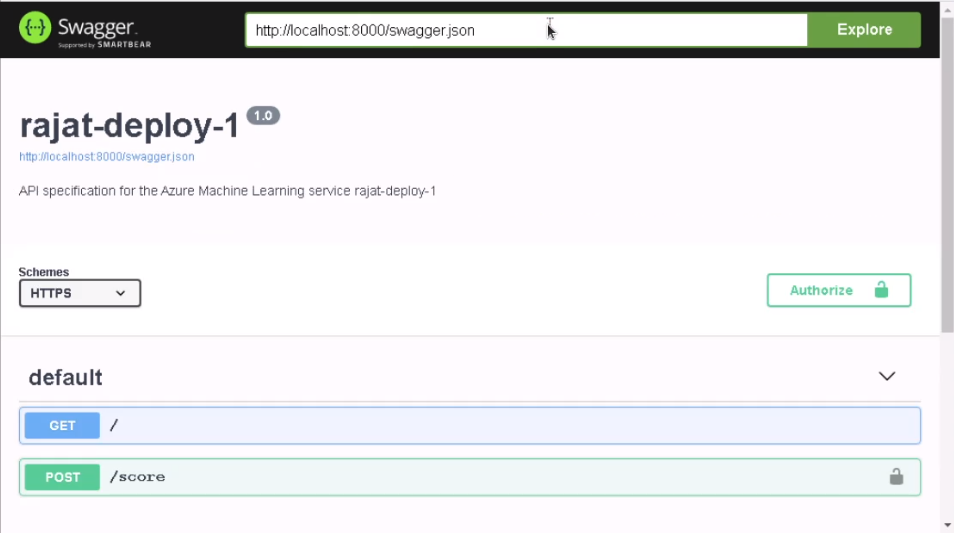
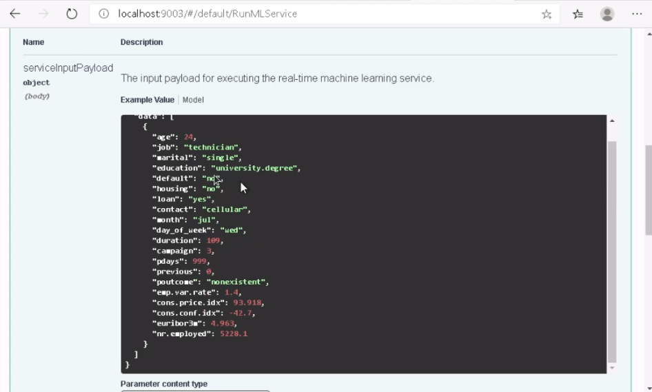
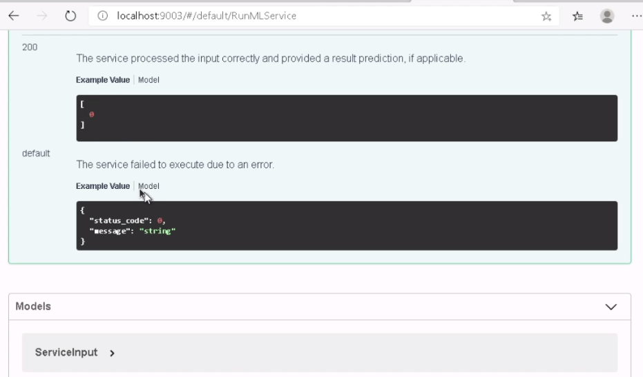
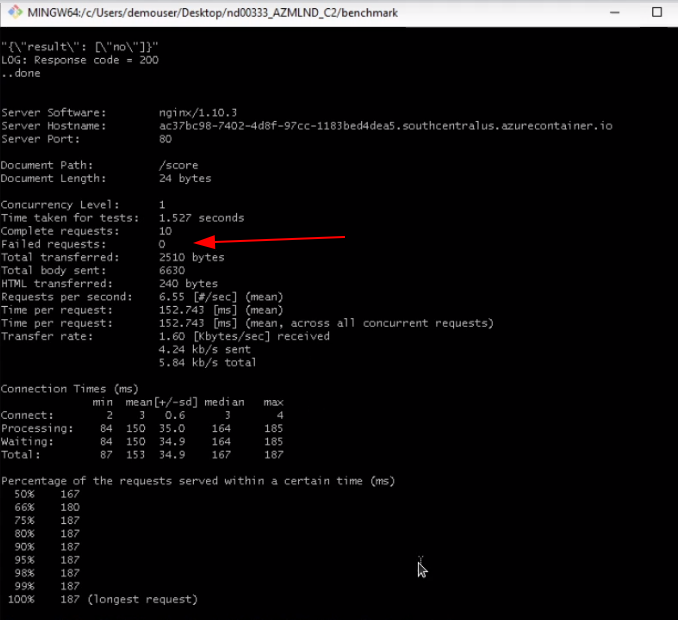
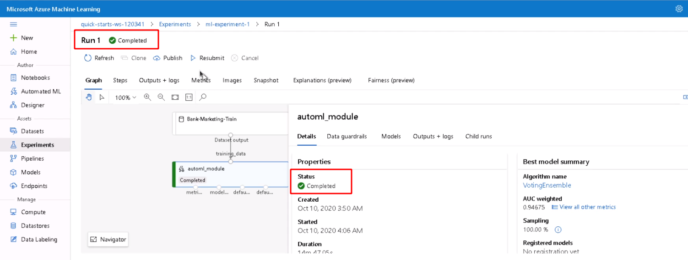

# Operationalizing Machine Learning

One of the most important things is that **"DevOps"** refers to the collection of principles that allow getting software into production, or in this case, trained models. MLOps (Machine Learning Operations) is about applying DevOps best-practices and principles to machine learning operations.

In this project, I have used Azure to configure a cloud-based machine learning production model, deploy it, and consume it. This project demonstrates the procedure of creating, publishing, and consuming a pipeline.

## Main Steps:
1. Automated ML Experiment
2. Deploy the best model
3. Enable logging
4. Swagger Documentation
5. Consume model endpoints
6. Create and publish a pipeline
7. Documentation

## Architectural Diagram

## Key Steps
## Step 1: Automated ML Experiment
The aim of this step is to create an experiment using Automated ML, configure a compute cluster, and use that cluster to run the experiment.

#### Dataset

#### Completion of experiment

#### Selection of Best Model

## Step 2: Deploy the Model
After the experiment run completes, deploying the Best Model will allow to interact with the HTTP API service and interact with the model by sending data over POST requests.

## Step 3: Enable Application Insights
Once the Best Model is deployed, enable Application Insights and retrieve logs. Although this is configurable at deploy time with a check-box, it is useful to be able to run code that will enable it for us.

#### Check for Application Insights

#### Running Logs script on terminal

#### Log Dashboard

## Step 4: Swagger Documentation
we are ready with the deployed model and enabled logs. Now it's time to test the REST APIs using Swagger. This provides a JSON file to test the get and post functionality of the Deployed API through which we will communicate with the model.

#### Swagger UI

## Step 5: Consume Model Endpoints
Once we finish the test, it's time to consume the deployed model via Endpoints. In this step, we run a script, having scoring_uri and the key to match the key for our service and the URI that was generated after deployment. 

#### Result after consuming endpoint

#### Apache benchmark

## Step 6: Create, Publish and Consume a Pipeline
In the repo, you will see a Jupyter Notebook which we used for creating, publishing and consuming pipeline. 

#### Created Pipeline in Azure ML studio

#### Pipeline Endpoint in Azure ML studio

#### Bankmarketing dataset with the AutoML module

#### REST Endpoint and status of Published Pipeline

#### RunDetails Widget

#### Scheduled Run in Azure ML studio

## Future Scope
The future scope of the project can be to:
* create a docker image for deploying the whole pipeline
* integrate a alert management system to get Emails for fault and error in the production.

## Brief Introductory Video

## Licencse
Licensed under the MIT License @ Udacity

## Issues/Bugs
Please open issues on github to report bugs or make feature requests

## Contribution
If you are interested in improving the code, please open an issue first to describe the task you are planning to do. For small fixes (a few lines of change) feel free to open pull requests directly.
